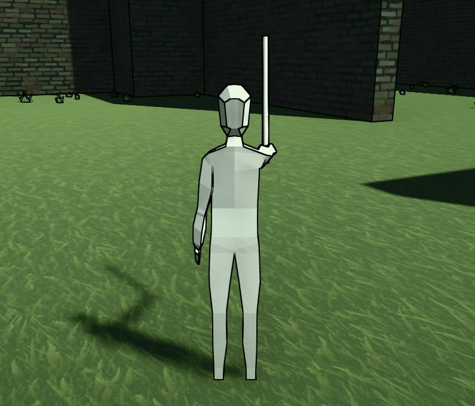

# Heart of the Forest
Heart of the Forest is a WIP adventure game with a puzzling story and
a focus on combat mechanics.

## Development Updates
[Follow me on Twitter](https://twitter.com/bpmw_) for regular updates.

### January 2019
Maze generation, basic combat. Working on enemy targeting.
<blockquote class="twitter-tweet" data-lang="en">
targeting! <a href="https://twitter.com/hashtag/gamedev?src=hash&amp;ref_src=twsrc%5Etfw">#gamedev</a> <a href="https://t.co/akO0Z9GOci">pic.twitter.com/akO0Z9GOci</a>
&mdash; ben (@bpmw_) <a href="https://twitter.com/bpmw_/status/1091075956842758145?ref_src=twsrc%5Etfw">January 31, 2019</a></blockquote>

