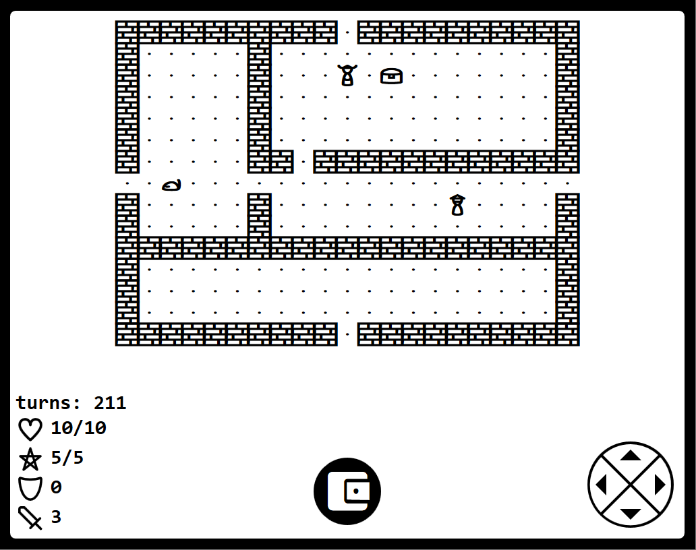

# Paperlike
Paperlike is a small, unfinished minimalistic roguelike written in Javascript.
My original inspiration for it was the Kindle Paperwhite experimental browser,
which can run some very basic Javascript applications.

<a class="minicard" href="../paperlike"> Play Demo </a>

The source code is available [here](https://github.com/benpm/paperlike).
